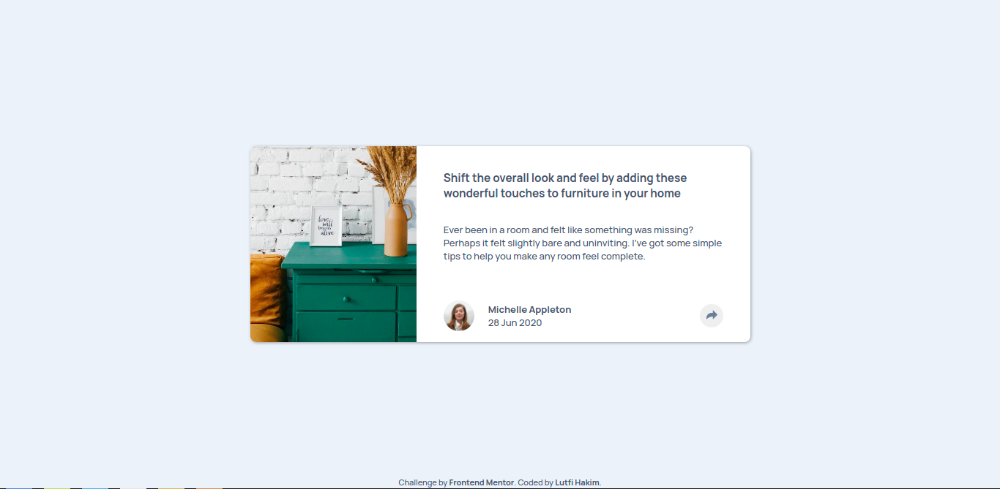
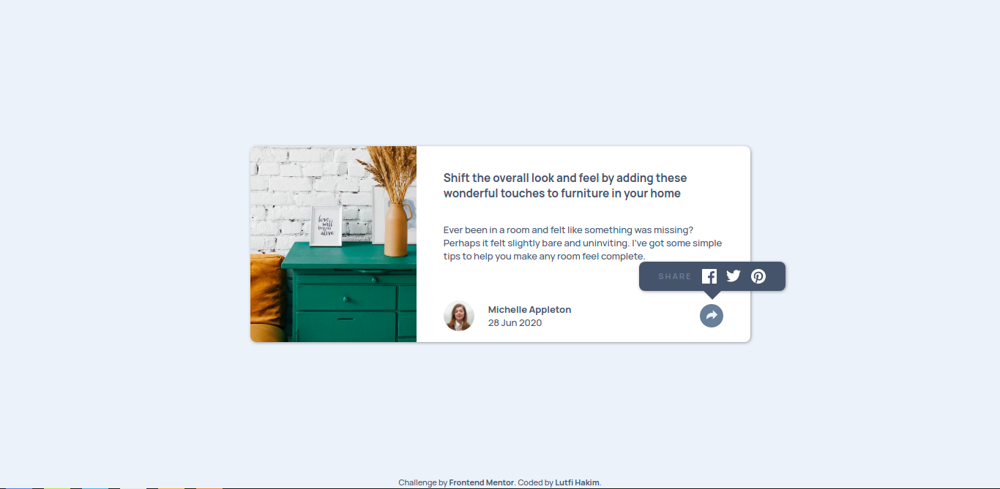
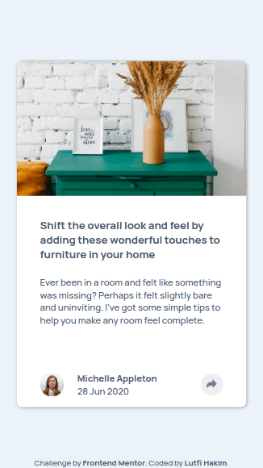
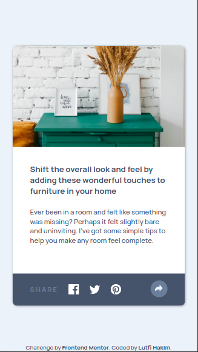

# Frontend Mentor - Article preview component solution

This is a solution to the [Article preview component challenge on Frontend Mentor](https://www.frontendmentor.io/challenges/article-preview-component-dYBN_pYFT). Frontend Mentor challenges help you improve your coding skills by building realistic projects. 

## Table of contents

- [Overview](#overview)
  - [The challenge](#the-challenge)
  - [Screenshot](#screenshot)
  - [Links](#links)
- [My process](#my-process)
  - [Built with](#built-with)
  - [What I learned](#what-i-learned)
  - [Continued development](#continued-development)
  - [Useful resources](#useful-resources)
- [Author](#author)

**Note: Delete this note and update the table of contents based on what sections you keep.**

## Overview

### The challenge

Users should be able to:

- View the optimal layout for the component depending on their device's screen size
- See the social media share links when they click the share icon

### Screenshot

### Links

- Solution URL: [Add solution URL here](https://your-solution-url.com)
- Live Site URL: [Add live site URL here](https://your-live-site-url.com)

## My process

### Built with

- HTML
- CSS
- JavaScript

### What I learned

I have project using Vue.js before, but this is my first project using pure JavaScript. So, I have learn some JavaScript DOM manipulation.

However, the CSS part is make me feel confuse. Especially on layouting when I make it responsive.

What I learn from this project is nesting HTML element, layouting, and how to use JavaScript to make it interactive.

To see how you can add code snippets, see below:

### Continued development

Some parts on this project is need an improvement. Next time, I want to add some animation when I click the share button.

When I have learned API, I want to add some API on the share link, so when user klick on faceboock/twitter/pinterest icon, they will redirected to share dialog.

### Useful resources

- [CSS Tricks](https://css-tricks.com/almanac/) - This helped me for styling and layouting with CSS.
- [W3Schools](https://www.w3schools.com/) - You already know what it this.
- [Stackoverflow](https://stackoverflow.com/) - When you get stuck, you go there.

## Author

- Frontend Mentor - [@lutfihakim28](https://www.frontendmentor.io/profile/lutfihakim28)
- Twitter - [@upilMarkupil](https://www.twitter.com/upilMarkupil)

